[](https://travis-ci.org/IBM/innovate-digital-bank)

# Building a Digital Bank with Node.js, Express, MongoDB, & Kubernetes

In this Code Pattern, we will build a dummy digital bank composed of a set of microservices that communicate with each other. We'll be using Node.js, Express, MongoDB, and the IBM Cloud Container Service.

Development of [cloud native apps](https://www.cncf.io/blog/2017/05/15/developing-cloud-native-applications/) that are broken down into a set of [microservices](http://microservices.io/) has been praised and commended as best-practice in software development methodologies. Software stacks like [Kubernetes](https://kubernetes.io/), which enable cloud native computing, have therefore picked up quite a bit of popularity.

It’s a little _(a lot)_ more fun, however, to build a so-called cloud native app, than to talk about one.

So here's our attempt:

We’ll take a use-case that has a bit of real-world familiarity to it — A digital bank. Naturally inspired by [Monzo](http://monzo.com/). Let’s call it Innovate.

[A live version deployed on a Kubernetes cluster in IBM Cloud is available for you to try here](http://ibm.biz/digibank).
To test it out, sign up for an account. A process runs periodically to dump randomized transactions and bills for user accounts, so give it a couple of minutes and refresh to see your populated profile.

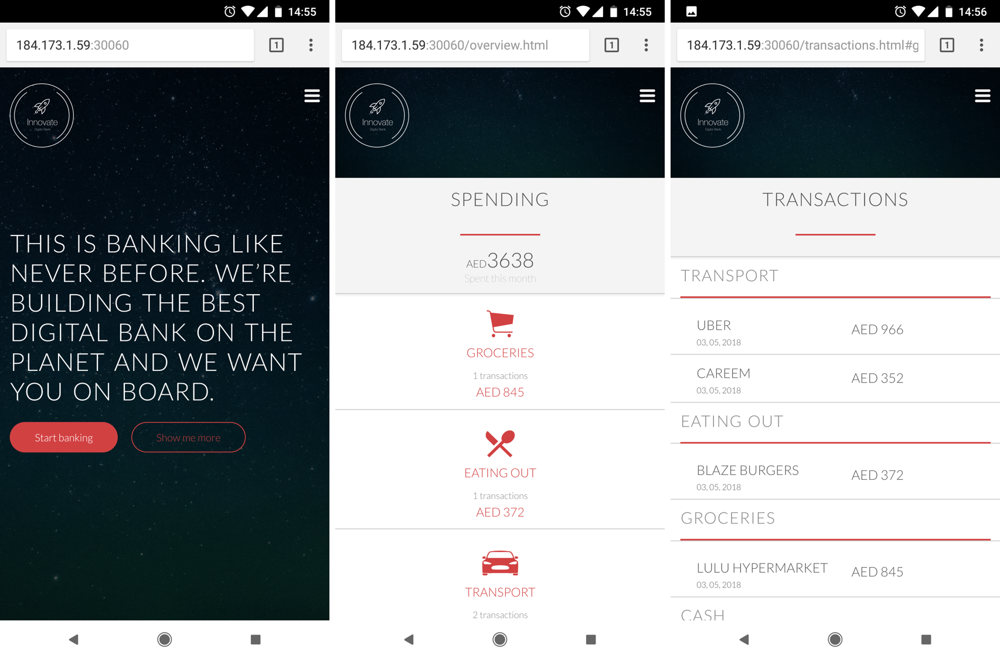

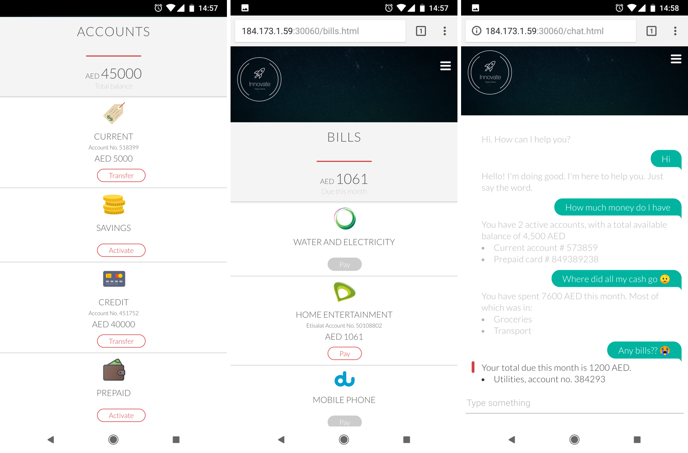

## Learning objectives

When you've completed this Code Pattern, you will understand how to:

* Break an application down to a set of microservices
* Create and manage a Kubernetes cluster on IBM Cloud
* Deploy to a Kubernetes cluster on IBM Cloud
* Deploy to IBM Cloud Private

## Flow

When thinking of business capabilities, our imaginary bank will need the following set of microservices:

1. *Portal:* Loads the UI and takes care of user sessions and relies on all other microservices for core functionality.
2. *Authentication:* Handles user profile creation, as well as login & logout.
3. *Accounts:* Handles creation, management, and retrieval of a user’s banking accounts.
4. *Transactions:* Handles creation and retrieval of transactions made against users' bank accounts.
5. *Bills:* Handles creation, payment, and retrieval of bills.
6. *Support:* Handles communication with Watson Assistant to enable a support chat feature.

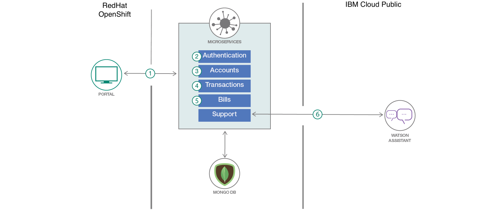

## Included components

* [IBM Cloud Container Service](https://console.bluemix.net/doc/source/images/containers/container_index.html): IBM Bluemix Container Service manages highly available apps inside Docker containers and Kubernetes clusters on the IBM Cloud.
* [Kubernetes Cluster](https://console.bluemix.net/doc/source/images/containers/container_index.html): Create and manage your own cloud infrastructure and use Kubernetes as your container orchestration engine.
* [Microservice Builder](https://developer.ibm.com/microservice-builder): Learn, build, run, and manage applications in a microservices framework.
* [Watson Assistant](https://www.ibm.com/watson/developercloud/conversation.html): Create a chatbot with a program that conducts a conversation via auditory or textual methods.

## Featured technologies

* [Microservices](https://www.ibm.com/developerworks/community/blogs/5things/entry/5_things_to_know_about_microservices?lang=en): Collection of fine-grained, loosely coupled services using a lightweight protocol to provide building blocks in modern application composition in the cloud.
* [Node.js](https://nodejs.org/): An open-source JavaScript run-time environment for executing server-side JavaScript code.
* [Containers](https://www.ibm.com/cloud-computing/bluemix/containers): Virtual software objects that include all the elements that an app needs to run.
* [Databases](https://en.wikipedia.org/wiki/IBM_Information_Management_System#.22Full_Function.22_databases): Repository for storing and managing collections of data.
* [Hybrid Integration](https://www.ibm.com/cloud-computing/bluemix/hybrid-architecture): Enabling customers to draw on the capabilities of public cloud service providers while using private cloud deployment for sensitive applications and data.

# Watch the Video

[](https://www.youtube.com/watch?v=1F1EnnMrsZ8)

# Setup
You have multiple options to setup your own instance:
* [Run it locally](#run-locally)
* [Deploy to IBM Cloud the hard way (manual, multi-stage)](#deploy-to-ibm-cloud-the-hard-way)
* [Deploy to IBM Cloud Private](#deploy-to-ibm-cloud-private)

# Run Locally

### 1. Clone the repo
Clone the `innovate-digital-bank` repository locally. In a terminal, run:

```
$ git clone https://github.com/IBM/innovate-digital-bank.git
```

### 2. Create an Instance of MongoDB

This demo heavily depends on mongo as a session & data store.

From the [IBM Cloud catalog](https://console.bluemix.net/catalog/), find **Compose for MongoDB** and click create. Give it a name, choose a region, pick the standard pricing plan and click create.

**Get your mongo connection string. Almost all your microservices need it; keep it safe!**


### 3. Configure your environment variables

Each of the 7 microservices must have a _**.env**_ file that stores all credentials.

An example is already provided within each folder. From the directory of each microservice, copy the example file, rename it to _**.env**_, and fill it with the appropriate values.

For example, from within the **/innovate** folder, navigate into the accounts folder

```
$ cd accounts
```

Next, copy and rename the _**.env.example**_ folder

```
$ cp .env.example .env
```

Finally, edit your **.env** folder and add your Mongodb connection string

***Repeat these steps for all microservices. In addition to your mongo URL, most will need the public IP address of your Kubernetes cluster, _You can find that under the overview of your cluster on IBM Cloud_.***

### 4. Configure your environment mode
When running the app locally without Kubernetes, the microservices do not run on the NodePorts specified in our helm chart, so we need to point our portal and userbase microservices to the correct ports.

If you're running on macOS or any linux-based system, run the following in a terminal from the git repo's directory

```
$ export NODE_ENV=development
```

if you're running on Windows, edit the NODE_ENV attribute in your .env file from within the **/portal** folder and the **/userbase** folder to the following:

```
NODE_ENV=development
```

### 5. Run
Finally, navigate to each microservice folder, and start it. Make sure you run the 7 microservice in 7 separate terminals.

```
$ npm start
```

You can now visit `localhost:3100` to access the portal

# Deploy to IBM Cloud the Hard Way
> NOTE: This guide requires a paid/upgraded account on IBM Cloud. You **cannot** complete the steps with a free or lite account.

1. [Get the tools](#1-get-the-tools)
2. [Clone the repo](#2-clone-the-repo)
3. [Login to IBM Cloud](#3-login-to-ibm-cloud)
4. [Create a cluster](#4-create-a-cluster-)
5. [Create an instance of MongoDB](#5-create-an-instance-of-mongodb)
6. [Configure your deploy target](#6-configure-your-deploy-target)
7. [Configure your environment variables](#7-configure-your-environment-variables)
8. [Configure kubectl](#8-configure-kubectl)
9. [Initialize helm](#9-initialize-helm)
10. [Deploy](#10-deploy)

### 1. Get the tools
You'll need each of the following pre-requisites:
* [IBM Cloud Developer Tools CLI](https://console.bluemix.net/docs/cli/reference/bluemix_cli/get_started.html)

* the [Kubernetes CLI](https://kubernetes.io/doc/source/images/user-guide/prereqs/)

* the container service plugin

once you've downloaded the IBM Cloud Developer Tools CLI, in a terminal, run:

```
$ ibmcloud plugin install container-service -r Bluemix
```

* the container registry plugin

in a terminal, run:

```
$ ibmcloud plugin install container-registry -r Bluemix
```
* ibmcloud dev plugin
```
ibmcloud plugin install dev -r Bluemix
```
### 2. Clone the repo
Clone the `innovate-digital-bank` repository locally. In a terminal, run:

```
$ git clone https://github.com/IBM/innovate-digital-bank.git
```
### 3. Login to IBM Cloud
Both through the [console](https://console.bluemix.net/) and your terminal
> NOTE: If you need to specify the region you want to deploy in, you can do so by adding the `-a` flag followed by the region URL.

```
$ ibmcloud login
```

### 4. Create a cluster

From the catalog, find **Containers in Kubernetes Clusters** and click create. Choose a region and a cluster type, and create your cluster. Allow it some time to deploy.

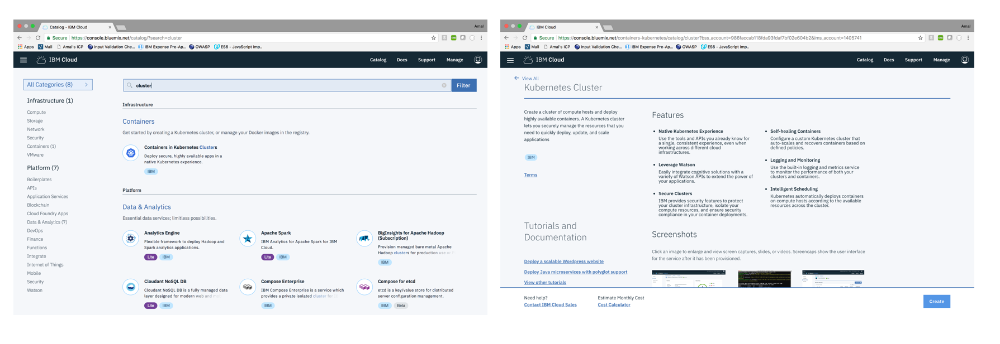

### 5. Create an instance of MongoDB

This demo heavily depends on mongo as a session & data store.

From the [catalog](https://console.bluemix.net/catalog/), find **Compose for MongoDB** and click create. Give it a name, choose a region, pick the standard pricing plan and click create.

**Get your mongo connection string. Almost all your microservices need it; keep it safe!**


### 6. Configure your deploy target

Each of the 7 docker images needs to be pushed to your docker image registry on IBM Cloud. You need to set the correct _**deploy target**_.
Depending on the region you've created your cluster in, your url will be in the following format

```
registry.<REGION_ABBREVIATION>.bluemix.net/<YOUR_NAMESPACE>/<YOUR_IMAGE_NAME>
```

For example, to deploy the accounts microservice to my docker image registry in the US-South region, my **deploy_target** will be:

```
registry.ng.bluemix.net/amalamine/innovate-accounts
```

If you need to get your namespace, run:

```
$ ibmcloud cr namespace-list
```

You can also add a new namespace by running:

```
$ ibmcloud cr namespace-add <NAME>
```

From the directory of each microservice, replace the deploy target in ***cli-config.yml*** & in ***/chart/innovate-<MICROSERVICE_NAME>/values.yaml*** with the correct one

For example, from within the **/innovate** folder, navigate into the accounts folder

```
$ cd accounts
```

Next, edit line 58 of [cli-config.yaml](https://github.com/aamine0/innovate-digital-bank/blob/master/accounts/cli-config.yml) file. Replace the ***deploy-image-target*** with the correct value.

```
deploy-image-target: "registry.ng.bluemix.net/amalamine/innovate-accounts"
```

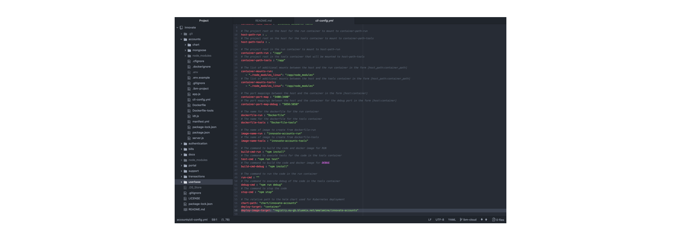

Edit line 6 of the [values.yaml](https://github.com/aamine0/innovate-digital-bank/blob/master/accounts/chart/innovate-accounts/values.yaml) file. Replace the ***repository*** with the correct value.

```
repository: registry.ng.bluemix.net/amalamine/innovate-accounts
```

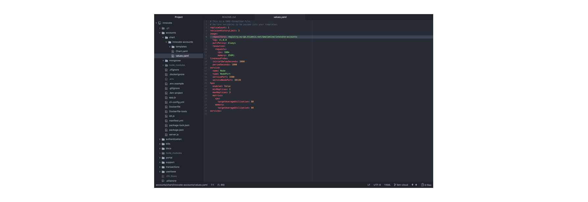

**Repeat these steps for all 7 microservices.**

### 7. Configure your environment variables

Each of the 7 microservices must have a _**.env**_ file that stores all credentials.

An example is already provided within each folder. From the directory of each microservice, copy the example file, rename it to _**.env**_, and fill it with the appropriate values.

For example, from within the **/innovate** folder, navigate into the accounts folder

```
$ cd accounts
```

Next, copy and rename the _**.env.example**_ folder

```
$ cp .env.example .env
```

Finally, edit your .env folder and add your Mongodb connection string

***Repeat these steps for all microservices. In addition to your mongo URL, most will need the public IP address of your Kubernetes cluster, _You can find that under the overview of your cluster on IBM Cloud_.***

### 8. Configure kubectl

Run the following command:

```
$ ibmcloud cs cluster-config <YOUR_CLUSTER_NAME>
```

Then copy the output and paste it in your terminal

### 9. Initialize helm
If you dont have helm installed [Install Here](https://docs.helm.sh/using_helm/#install-helm)

```
$ helm init
```

### 10. Deploy
Finally, navigate to each microservice folder, and run the following command

```
$ ibmcloud dev deploy
```

Once done, you'll be able to access the portal on port _30060_ of your cluster's _public IP address_, which you can find under the overview of your cluster on IBM Cloud.
Or if you are logged in `ibmcloud` cli, you can find your public ip of your worker node by

```
$ ibmcloud cs workers <name-of-cluster>
```

# Deploy to IBM Cloud Private

If you have an instance of IBM Cloud Private running, you can follow the steps below to deploy the app. If you'd like to deploy your own instance of ICP, [you can follow this great writeup](https://github.com/IBM/deploy-ibm-cloud-private).

1. [Create a persistent volume](#1-create-a-persistent-volume)
2. [Create a persistent volume claim](#2-create-a-persistent-volume-claim)
3. [Create an instance of MongoDB](#3-create-an-instance-of-mongodb)
4. [Configure your environment variables](#4-configure-your-environment-variables)
5. [Add your ICP's address to your hosts file](#5-add-your-icps-address-to-your-hosts-file)
6. [Login to docker](#6-login-to-docker)
7. [Configure kubectl](#7-configure-kubectl)
8. [Deploy](#8-deploy)

### 1. Create a persistent volume
This demo heavily depends on mongo as a session & data store.
From ICP's menu, click on Storage > Create persistent volume. Give it a name and a capacity, choose storage type _**Hostpath**_, and add a _**path parameter**_

[More details here](./creating-pv.md)

### 2. Create a persistent volume claim
From ICP's menu, click on storage > create persistent volume claim. Give it a name and a storage request value

[More details here](./creating-pvc.md)

### 3. Create an instance of MongoDB
From the catalog, choose MongoDb. Give it a **_name_**, specify the **_existing volume claim name_**, and give it a *_password_*

[More details here](./mongo-db.md)

***Get your mongo connection string; Almost all your microservices need it; keep it safe!***

Your connection string will be in the following format:
```
mongodb://<USERNAME>:<PASSWORD>@<HOST>:<PORT>/<DATABASE_NAME>
```

### 4. Configure your environment variables

Each of the 7 microservices must have a _**.env**_ file.

An example is already provided within each folder. From the directory of each microservice, copy the example file, rename it to _**.env**_, and fill it with the appropriate values.

For example, from within the **/innovate** folder, navigate into the accounts folder

```
$ cd accounts
```

Next, copy and rename the _**.env.example**_ folder

```
$ cp .env.example .env
```

Finally, edit your **.env** folder and add your Mongodb connection string

***Repeat those steps for all microservices. In addition to your mongo url, you may the IP address of your ICP.***

### 5. Add your ICP's address to your hosts file
Add an entry to your /etc/hosts file as follows

```
<YOUR_ICP_IP_ADDRESS> mycluster.icp
```

### 6. Login to docker
For Mac users, if you are running ICP locally in vm you would also have to add the cluster info to the insecure registry. To do so go to docker > preference > daemon 
enable experimental features and add cluster to insecure registries list.

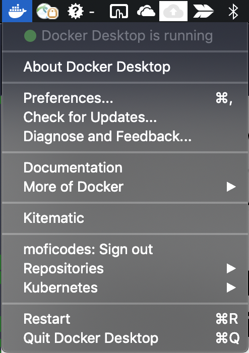 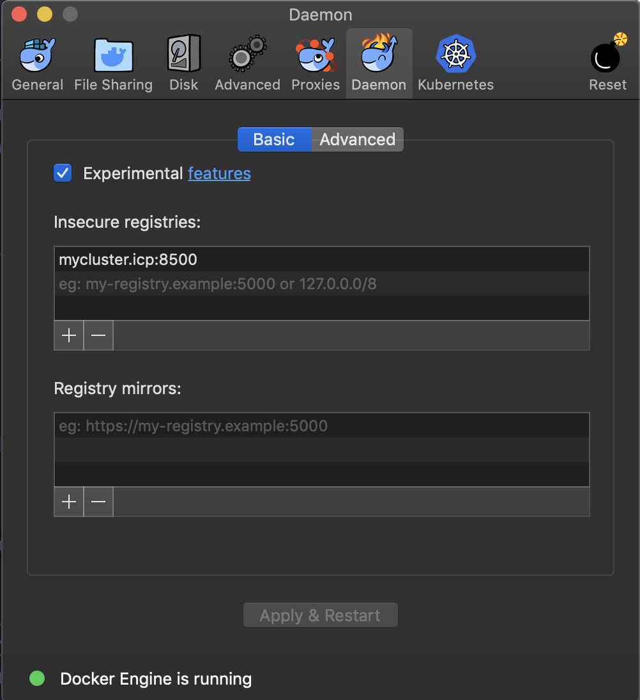

```
$ docker login mycluster.icp:8500
```


### 7. Configure kubectl
From your ICP's dashboard, copy the kubectl commands under `admin` > `configure client`


### 8. Configure cloudctl
`cloudctl` is IBM Cloud Private cli. 
To find the CLI for your ICP version, navigate to `menu` > `Command Line Tools` > `Cloud Private CLI` and follow instruction to get `cloudctl` installed.
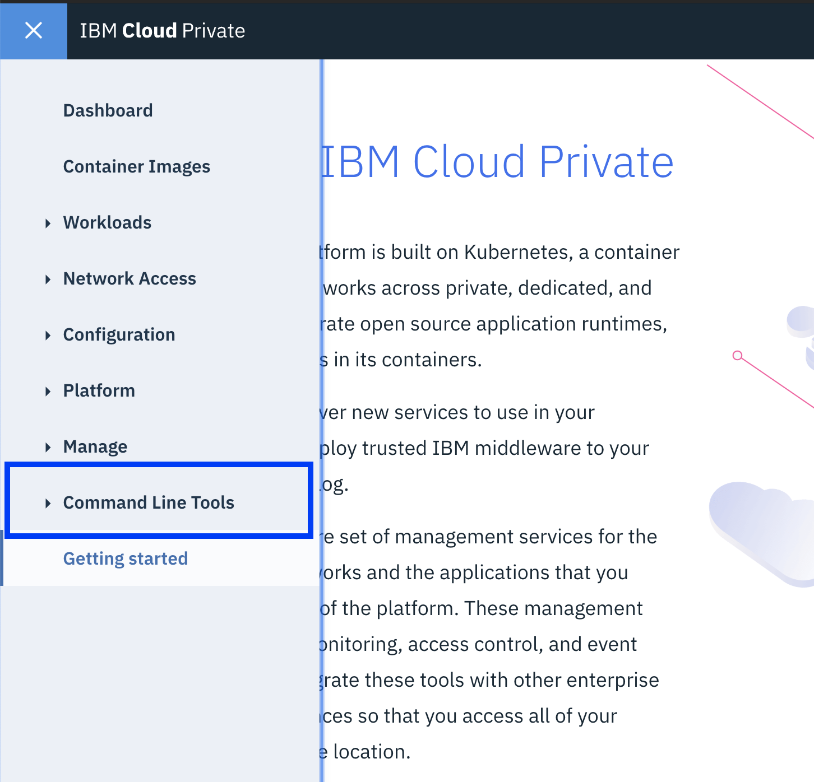
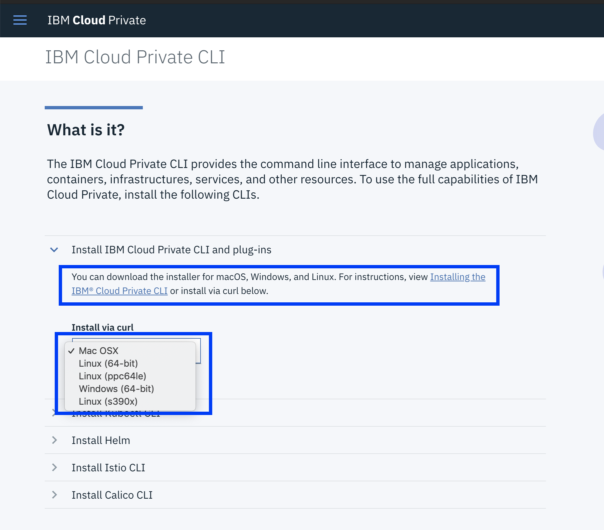

Once you have `cloudctl` cli installed, log into **ICP**
```
cloudctl login -a https://mycluster.icp:8443 -u admin --skip-ssl-validation
``` 
The password for local vm ICP is _admin_

### 9. Helm
If you don't have helm already, [Install Here](https://docs.helm.sh/using_helm/#install-helm)

```
helm init
```
### 10. Deploy
Finally, navigate to each microservice, and run the following command

```
$ ibmcloud dev deploy
```

_If you don't have the IBM Cloud Developer Tools CLI installed, get it [here](https://console.bluemix.net/doc/source/images/cli/reference/bluemix_cli/download_cli.html) first_

Once the deployment is successfully completed, you can access the portal on port _30060_ of your _ICP's IP address_.

# (Optional) Adding Support with Watson Assistant
The support microservice connects to an instance of Watson Assistant on IBM Cloud to simulate a chat with a virtual support agent.

> NOTE: This is an optional step. You need it if you'd like to enable the support feature on the app.

1. [Create an instance of Watson Assistant](#1-create-an-instance-of-watson-assistant)
2. [Get your credentials](#2-get-your-credentials)
3. [Configure your environment variables](#3-configure-your-environment-variables)
4. [Deploy](#4-deploy)

### 1. Create an instance of Watson Assistant
From the [IBM Cloud Catalog](bluemix.net), choose Watson Conversation, and click create.

### 2. Get your credentials
Navigate to the credentials tab and copy your username and password

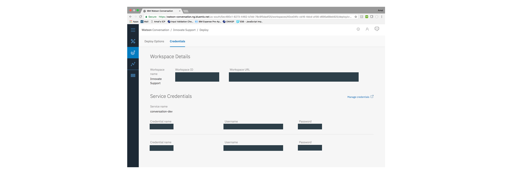

### 3. Configure your environment variables
From within the support folder, edit your .env to include your newly acquired credentials

### 4. Deploy
Redeploy the support microservice, the support feature should now be accessible through the portal.

```
$ ibmcloud dev deploy
```

# Troubleshooting

1. Trouble with IBM Clouc Cli? [Check Here](https://console.bluemix.net/docs/cli/ts_createapps.html#troubleshoot)
2. IBM Cloud Private common errors and solutions can be found [here](https://www.ibm.com/support/knowledgecenter/en/SS8G7U_18.2.0/com.ibm.app.mgmt.doc/content/trouble_common_deployment_errors.htm)
3. IBM Cloud Private on local vm not working? Check ICP version, Vagrant version and VirtualBox version carefully. Update them if necessary. If all else fails, `vagrant destroy` and `vagrant up` again to reset the cluster.
 

# Learn more

* **Artificial Intelligence Code Patterns**: Enjoyed this Code Pattern? Check out our other [AI Code Patterns](https://developer.ibm.com/code/technologies/artificial-intelligence/).
* **Data Analytics Code Patterns**: Enjoyed this Code Pattern? Check out our other [Data Analytics Code Patterns](https://developer.ibm.com/code/technologies/data-science/)
* **AI and Data Code Pattern Playlist**: Bookmark our [playlist](https://www.youtube.com/playlist?list=PLzUbsvIyrNfknNewObx5N7uGZ5FKH0Fde) with all of our Code Pattern videos
* **With Watson**: Want to take your Watson app to the next level? Looking to utilize Watson Brand assets? [Join the With Watson program](https://www.ibm.com/watson/with-watson/) to leverage exclusive brand, marketing, and tech resources to amplify and accelerate your Watson embedded commercial solution.
* **Data Science Experience**: Master the art of data science with IBM's [Data Science Experience](https://datascience.ibm.com/)
* **Kubernetes on IBM Cloud**: Deliver your apps with the combined the power of [Kubernetes and Docker on IBM Cloud](https://www.ibm.com/cloud-computing/bluemix/containers)

# Docs

Documentation of all the backend endpoints is available [here](/DOCS.md)

# License

This code pattern is licensed under the Apache Software License, Version 2.  Separate third party code objects invoked within this code pattern are licensed by their respective providers pursuant to their own separate licenses. Contributions are subject to the [Developer Certificate of Origin, Version 1.1 (DCO)](https://developercertificate.org/) and the [Apache Software License, Version 2](http://www.apache.org/licenses/LICENSE-2.0.txt).

[Apache Software License (ASL) FAQ](http://www.apache.org/foundation/license-faq.html#WhatDoesItMEAN)
