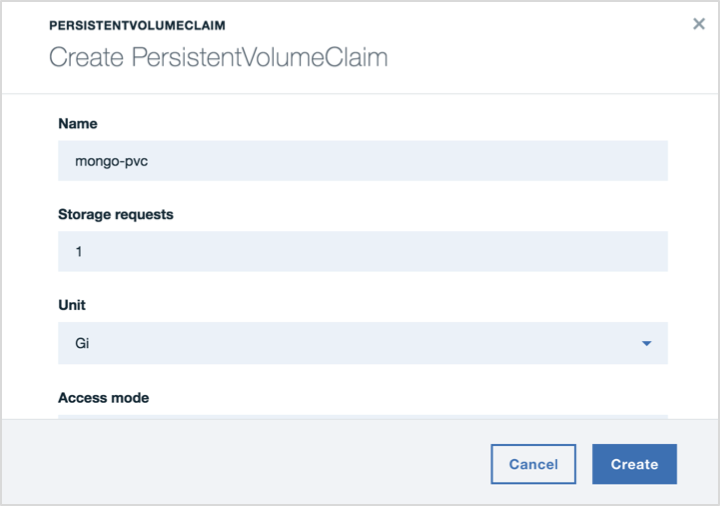

# Innovate: Digital Bank
Innovate is a dummy digital bank composed of a set of microservices that communicate with each other; created to demonstrate cloud-native web apps.
<!-- A live version deployed on a kubernetes cluster in IBM Cloud is available here: -->

## Flow


## Microservices

### Portal [3000:30060]

Loads the UI and takes care of user sessions. Communicates with all other microservices.

### Authentication [3200:30100]

Handles user profile creation, as well as login & logout.

#### Endpoints:

##### /api/user/create

Description: Creates a new user account

Method: POST

Example input:

```
{
  uuid: String,
  name: String,
  email: String,
  phone: String,
  gender: String,
  dob: String,
  eid: String,
  password: String
}
```

##### /api/user/authenticate

Description: Authenticates a user

Method: POST

Example input:

```
{
  email: String,
  password: String
}
```

##### /api/user/get

Description: Returns a list of all users

Method: GET

### Accounts [3400:30120]

Handles creation, management, and retrieval of a user's banking accounts.

#### Endpoints:

##### /api/accounts/create

Description: Creates a new user account

Method: POST

Example input:

```
{
  uuid: String,
  type: String,
  currency: String,
}
```
Notes:

The parameter uuid links the account to a user's unique identifier. Type has to be one of the following: current, savings, credit, prepaid

##### /api/accounts/get

Description: Retrieves a user's accounts

Method: POST

Example input:

```
{
  uuid: String
}
```

##### /api/accounts/deposit

Description: Deposits an amount to a user's account

Method: POST

Example input:

```
{
  number: String,
  amount: Number
}
```

Notes:

The parameter number references an account

##### /api/accounts/withdraw

Description: Withdraws an amount from a user's account

Method: POST

Example input:

```
{
  number: String,
  amount: Number
}
```

##### /api/accounts/drop

Description: Drops the accounts collection

Method: GET

### Transactions [3600:30140]

Handles creation and retrieval of transactions

#### Endpoints:

##### /api/transactions/create

Description: Creates a new transaction

Method: POST

Example input:

```
{
  uuid: String,
  amount: String,
  currency: String,
  description: String,
  date: String,
  category: String
}
```

##### /api/transactions/get

Description: Retrieves a user's transactions

Method: POST

Example input:

```
{
  uuid: String
}
```

##### /api/transactions/drop

Description: Drops the transactions collection

Method: GET

### Authentication 3200:30100

Handles user account creation, as well as login & logout.

### Authentication 3200:30100
Handles user account creation, as well as login & logout.

### Authentication 3200:30100
Handles user account creation, as well as login & logout.

- [x] Portal 3000:30060
- [x] Authentication 3200:30100
- [x] Accounts 3400:30120
- [x] Transactions 3600:30200
- [x] Bills 3800:30160
- [x] Support 4000:30180
- [x] Userbase 4200:30080

## Data stores

- [x] MongoDB


## Deploying Innovate on IBM Cloud Private

### Create an instance of MongoDB
This demo heavily depends on mongo as a session & data store.

#### 1. Create a persistent volume
Give it a name and a capacity, choose storage type _*Hostpath*_, and add a _*path parameter*_


#### 2. Create a persistent volume claim
Give it a name and a storage request value


#### 3. Create a persistent volume claim
Give it a name and a storage request value


### Portal
### Authentication
### Accounts
### Transactions
### Bills
### Support
### Userbase
