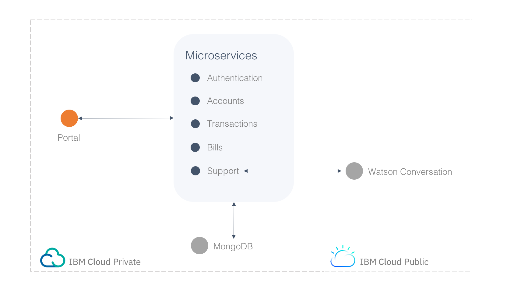
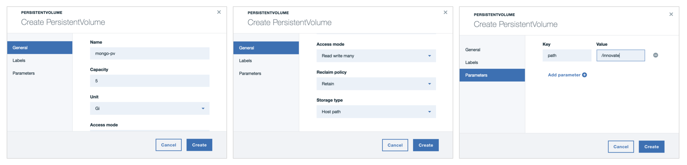
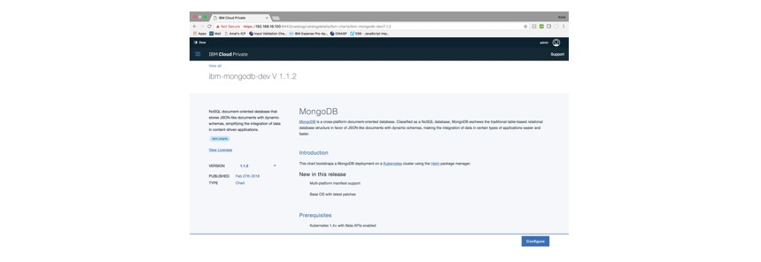
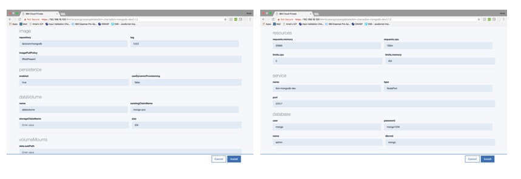

# Innovate: Digital Bank
Innovate is a dummy digital bank composed of a set of microservices that communicate with each other; created to demonstrate cloud-native web apps.
<!-- A live version deployed on a kubernetes cluster in IBM Cloud is available here: -->

# Architecture

## Flow


## Microservices

### Portal [3000:30060]

Loads the UI and takes care of user sessions. Communicates with all other microservices.

### Authentication [3200:30100]

Handles user profile creation, as well as login & logout.

#### Endpoints:

##### /api/user/create

Description: Creates a new user account

Method: POST

Example input:

```
{
  uuid: String,
  name: String,
  email: String,
  phone: String,
  gender: String,
  dob: String,
  eid: String,
  password: String
}
```

##### /api/user/authenticate

Description: Authenticates a user

Method: POST

Example input:

```
{
  email: String,
  password: String
}
```

##### /api/user/get

Description: Returns a list of all users

Method: GET

### Accounts [3400:30120]

Handles creation, management, and retrieval of a user's banking accounts.

#### Endpoints:

##### /api/accounts/create

Description: Creates a new user account

Method: POST

Example input:

```
{
  uuid: String,
  type: String,
  currency: String,
}
```
Notes:

The parameter uuid links the account to a user's unique identifier. Type has to be one of the following: current, savings, credit, prepaid

##### /api/accounts/get

Description: Retrieves a user's accounts

Method: POST

Example input:

```
{
  uuid: String
}
```

##### /api/accounts/deposit

Description: Deposits an amount to a user's account

Method: POST

Example input:

```
{
  number: String,
  amount: Number
}
```

Notes:

The parameter number references an account

##### /api/accounts/withdraw

Description: Withdraws an amount from a user's account

Method: POST

Example input:

```
{
  number: String,
  amount: Number
}
```

##### /api/accounts/drop

Description: Drops the accounts collection

Method: GET

### Transactions [3600:30140]

Handles creation and retrieval of transactions

#### Endpoints:

##### /api/transactions/create

Description: Creates a new transaction

Method: POST

Example input:

```
{
  uuid: String,
  amount: String,
  currency: String,
  description: String,
  date: String,
  category: String
}
```

##### /api/transactions/get

Description: Retrieves a user's transactions

Method: POST

Example input:

```
{
  uuid: String
}
```

##### /api/transactions/drop

Description: Drops the transactions collection

Method: GET

### Bills [3800:30160]

Handles creation, payment, and retrieval of bills

#### Endpoints:

##### /api/bills/create

Description: Creates a new bill

Method: POST

Example input:

```
{
  uuid: String,
  category: String,
  entity: String,
  account_no: String,
  amount: String,
  date: String
}
```

##### /api/bills/get

Description: Retrieves a user's bills

Method: POST

Example input:

```
{
  uuid: String
}
```

##### /api/bills/drop

Description: Drops the bills collection

Method: GET

### Support [4000:30180]

Handles communication with Watson Conversation on IBM Cloud to enable a dummy support chat feature.

### Userbase [3600:30140]

Simulates a fake userbase for the app. Periodically loops through all user accounts and adds randomized bills and transactions for them.


# Deploying on IBM Cloud Private

## Creating an instance of MongoDB
This demo heavily depends on mongo as a session & data store.

#### 1. Create a persistent volume
Give it a name and a capacity, choose storage type _**Hostpath**_, and add a _**path parameter**_



#### 2. Create a persistent volume claim
Give it a name and a storage request value


#### 3. Create and configure mongo
From the catalog, choose MongoDb. Give it a **_name_**, specify the **_existing volume claim name_**, and give it a *_password_*





#### 4. Get your mongo connection string
Your mongo connection string will be in the following format:
```
mongodb://<USERNAME>:<PASSWORD>@<HOST>:<PORT>/<DATABASE_NAME>
```

Almost all your microservices need it; keep it safe!

## Configuring your Environment Variables
Each of the 8 microservices must have a _**.env**_ file.

An example is already provided within each folder. From the directory of each microservice, copy the example file, rename it to _**.env**_, and fill it with the appropriate values.

For example, from within the /innovate folder, navigate into the accounts folder

```
cd accounts
```

Next, copy and rename the _**.env.example**_ folder

```
cp .env.example .env
```

Finally, edit your .env folder and add your Mongodb connection string

#### Repeat those steps for all microservices. In addition to your mongo url, the portal microservice will need the address of your ICP.
