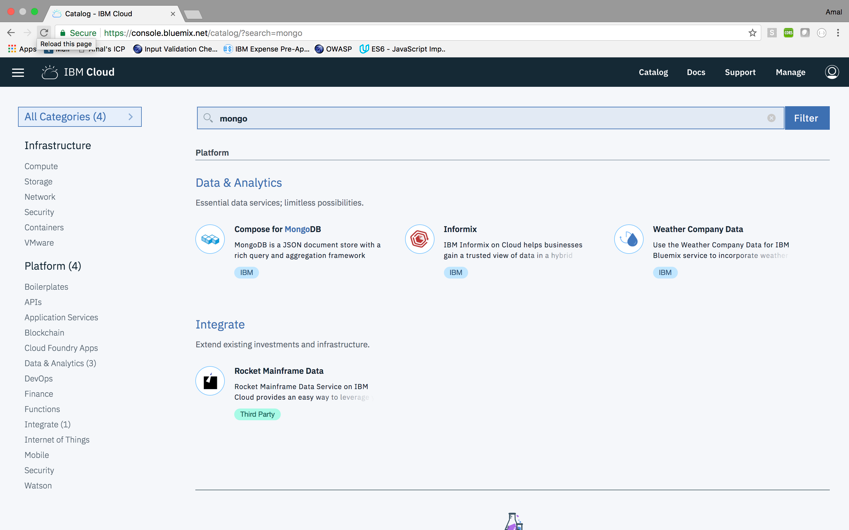
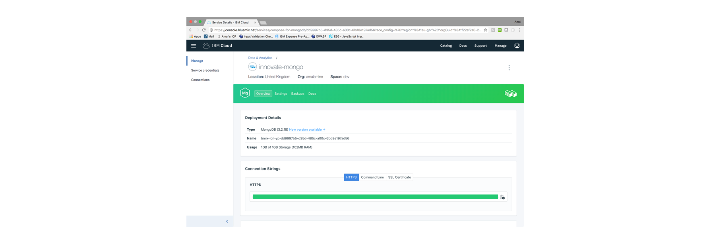
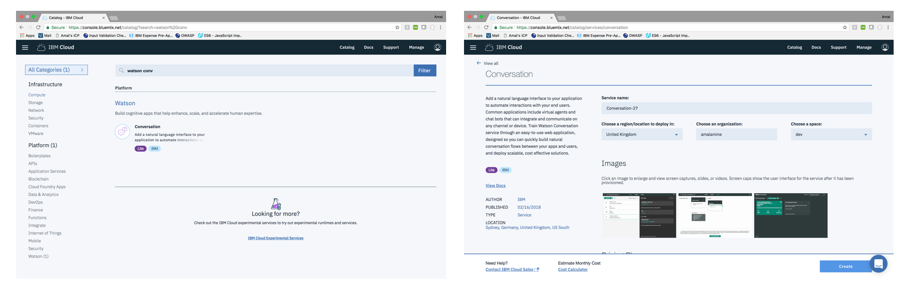
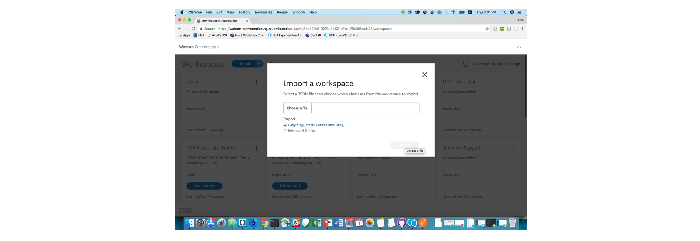

Table of Contents
=================

   * [About](#about)
      * [Flow](#flow)
   * [Guide: Deploying on IBM Cloud Private](#guide-deploying-on-ibm-cloud-private)
      * [Creating an instance of MongoDB](#creating-an-instance-of-mongodb)
      * [Configuring your Environment Variables](#configuring-your-environment-variables)
      * [Deploying all Components](#deploying-all-components)
   * [Guide: Deploying on IBM Cloud Platform](#guide-deploying-on-ibm-cloud-platform)
      * [Creating a cluster](#creating-a-cluster)
      * [Creating an instance of MongoDB](#creating-an-instance-of-mongodb-1)
      * [Configuring your Application](#configuring-your-application)
         * [Setting your deploy target](#setting-your-deploy-target)
         * [Setting your environment variables](#setting-your-environment-variables)
      * [Deploying all Components](#deploying-all-components-1)
      * [(Optional) Adding Support with Watson Conversation](#optional-adding-support-with-watson-conversation)
   * [Docs](#docs)
      * [Microservices](#microservices)
         * [Portal [3000:30060]](#portal-300030060)
         * [Authentication [3200:30100]](#authentication-320030100)
            * [Endpoints:](#endpoints)
               * [/api/user/create](#apiusercreate)
               * [/api/user/authenticate](#apiuserauthenticate)
               * [/api/user/get](#apiuserget)
         * [Accounts [3400:30120]](#accounts-340030120)
            * [Endpoints:](#endpoints-1)
               * [/api/accounts/create](#apiaccountscreate)
               * [/api/accounts/get](#apiaccountsget)
               * [/api/accounts/deposit](#apiaccountsdeposit)
               * [/api/accounts/withdraw](#apiaccountswithdraw)
               * [/api/accounts/drop](#apiaccountsdrop)
         * [Transactions [3600:30140]](#transactions-360030140)
            * [Endpoints:](#endpoints-2)
               * [/api/transactions/create](#apitransactionscreate)
               * [/api/transactions/get](#apitransactionsget)
               * [/api/transactions/drop](#apitransactionsdrop)
         * [Bills [3800:30160]](#bills-380030160)
            * [Endpoints:](#endpoints-3)
               * [/api/bills/create](#apibillscreate)
               * [/api/bills/get](#apibillsget)
               * [/api/bills/drop](#apibillsdrop)
         * [Support [4000:30180]](#support-400030180)
         * [Userbase [3600:30140]](#userbase-360030140)

# About
Innovate is a dummy digital bank composed of a set of microservices that communicate with each other; created to demonstrate cloud-native web apps.

A live version deployed on a kubernetes cluster in IBM Cloud is available here: http://184.173.1.59:30060/
To test it out, sign up for an account. A process runs periodically to dump randomized transactions and bills for user accounts, so give it a couple of minutes and refresh to see your populated profile. Otherwise, you can insert, modify & delete your own transactions, bills or accounts by directly invoking the APIs described in the [docs](#docs).

## Flow


# Guide: Deploying on IBM Cloud Private

## Creating an instance of MongoDB
This demo heavily depends on mongo as a session & data store.

#### 1. Create a persistent volume
Give it a name and a capacity, choose storage type _**Hostpath**_, and add a _**path parameter**_


#### 2. Create a persistent volume claim
Give it a name and a storage request value


#### 3. Create and configure mongo
From the catalog, choose MongoDb. Give it a **_name_**, specify the **_existing volume claim name_**, and give it a *_password_*


#### 4. Get your mongo connection string
Your mongo connection string will be in the following format:
```
mongodb://<USERNAME>:<PASSWORD>@<HOST>:<PORT>/<DATABASE_NAME>
```

Almost all your microservices need it; keep it safe!

## Configuring your Environment Variables
Each of the 8 microservices must have a _**.env**_ file.

An example is already provided within each folder. From the directory of each microservice, copy the example file, rename it to _**.env**_, and fill it with the appropriate values.

For example, from within the /innovate folder, navigate into the accounts folder

```
cd accounts
```

Next, copy and rename the _**.env.example**_ folder

```
cp .env.example .env
```

Finally, edit your .env folder and add your Mongodb connection string

#### Repeat those steps for all microservices. In addition to your mongo url, the portal microservice will need the address of your ICP.

## Deploying all Components
#### 1. Add your ICP's address to your hosts file
Add an entry to your /etc/hosts file as follows

```
<YOUR_ICP_IP_ADDRESS> mycluster.icp
```

#### 2. Login to docker

```
docker login mycluster.icp:8500
```

#### 3. Configure kubectl
From your ICP's dashboard, copy the kubectl commands under admin > configure client


#### 4. Deploy
Finally, navigate to each microservice, and run the following command
```
bx dev deploy
```
_If you don't have the IBM Cloud Developer Tools CLI installed, get it [here](https://console.bluemix.net/docs/cli/reference/bluemix_cli/download_cli.html) first_

# Guide: Deploying on IBM Cloud Platform

_This guide requires a paid/upgraded account on IBM Cloud. You **cannot** complete the steps with a free or lite account_

#### Download the [IBM Cloud Developer Tools CLI](https://console.bluemix.net/docs/cli/reference/bluemix_cli/get_started.html#getting-started)

#### Download the [Kubernetes CLI](https://kubernetes.io/docs/user-guide/prereqs/)

#### Install the container service plugin

```
bx plugin install container-service -r Bluemix
```

## Creating a cluster

#### 1. Login to [IBM Cloud](https://console.bluemix.net).
#### 2. From the catalog, find **Containers in Kubernetes Clusters** and click create
#### 3. Choose a region and a cluster type, and create your cluster.
#### 4. Allow your cluster some time to deploy.


## Creating an instance of MongoDB
This demo heavily depends on mongo as a session & data store.

#### 1. From the [catalog](https://console.bluemix.net/catalog/), find **Compose for MongoDB** and click create



#### 3. Give it a name, choose a region, pick the standard pricing plan and click create.
#### 4. Get your mongo connection string



Almost all your microservices need it; keep it safe!

## Configuring your Application

### Setting your deploy target
Each of the 8 docker images needs to be pushed to your docker image registry on IBM Cloud. You need to set the correct _**deploy target**_.
Your url will be in the following format

```
registry.<REGION_ABBREVIATION>.bluemix.net/<YOUR_NAMESPACE>/<YOUR_IMAGE_NAME>
```

For example, to deploy the accounts microservice to my docker image registry in the US-South region, my deploy_target will be:

```
registry.ng.bluemix.net/amalamine/innovate-accounts
```
#### to get your namespace, run:

```
bx cr namespace-list
```

From the directory of each microservice, replace the deploy target in ***cli-config.yml*** & in ***/chart/innovate-<MICROSERVICE_NAME>/values.yaml*** with the correct one

For example, from within the /innovate folder, navigate into the accounts folder

```
cd accounts
```

Next, edit line 58 of [cli-config.yaml](https://github.com/aamine0/innovate-digital-bank/blob/master/accounts/cli-config.yml) file. Replace the ***deploy-image-target*** with the correct value.

```
deploy-image-target: "registry.ng.bluemix.net/amalamine/innovate-accounts"
```


Edit line 6 of the [values.yaml](https://github.com/aamine0/innovate-digital-bank/blob/master/accounts/chart/innovate-accounts/values.yaml) file. Replace the ***repository*** with the correct value.

```
repository: registry.ng.bluemix.net/amalamine/innovate-accounts
```


#### Repeat these steps for all microservices.

### Setting your environment variables
Each of the 8 microservices must have a _**.env**_ file.

An example is already provided within each folder. From the directory of each microservice, copy the example file, rename it to _**.env**_, and fill it with the appropriate values.

For example, from within the /innovate folder, navigate into the accounts folder

```
cd accounts
```

Next, copy and rename the _**.env.example**_ folder

```
cp .env.example .env
```

Finally, edit your .env folder and add your Mongodb connection string

#### Repeat these steps for all microservices. In addition to your mongo url, most will need the public IP address of your kubernetes cluster, _You can find that under the overview of your cluster on IBM Cloud_.

## Deploying all Components
#### 1. Login to IBM Cloud
Specify the region you've deployed your cluster in
```
bx login -a https://api.<REGION_ABBREVIATION>.bluemix.net
```

#### 2. Configure kubectl
Run the following command:

```
bx cs cluster-config <YOUR_CLUSTER_NAME>
```

Then copy the output and paste it in your terminal

#### 3. Initialize helm

```
helm init
```

#### 4. Deploy
Finally, navigate to each microservice, and run the following command
```
bx dev deploy
```

## (Optional) Adding Support with Watson Conversation
The support microservice connects to an instance of Watson Conversation on IBM Cloud to simulate a chat with a virtual support agent.

#### 1. Create an instance of Watson Conversation
From the [IBM Cloud Catalog](bluemix.net), choose Watson Conversation, and click create.



#### 2. Import the support workspace
Import the [support workspace](/support/conversation-workspace.json) into your newly created Watson Conversation instance



#### 3. Get your credentials
Navigate to the deploy tab and copy your username, password, and workspace ID


#### 4. Edit your .env file
From within the support folder, edit your .env to include your newly acquired credentials

#### 5. Deploy
Redeploy the microservice, the support feature should now be accessible through the portal.

```
bx dev deploy
```

# Docs

## Microservices

### Portal [3000:30060]

Loads the UI and takes care of user sessions. Communicates with all other microservices.

### Authentication [3200:30100]

Handles user profile creation, as well as login & logout.

#### Endpoints:

##### /api/user/create

Description: Creates a new user account

Method: POST

Example input:

```
{
  uuid: String,
  name: String,
  email: String,
  phone: String,
  gender: String,
  dob: String,
  eid: String,
  password: String
}
```

##### /api/user/authenticate

Description: Authenticates a user

Method: POST

Example input:

```
{
  email: String,
  password: String
}
```

##### /api/user/get

Description: Returns a list of all users

Method: GET

### Accounts [3400:30120]

Handles creation, management, and retrieval of a user's banking accounts.

#### Endpoints:

##### /api/accounts/create

Description: Creates a new user account

Method: POST

Example input:

```
{
  uuid: String,
  type: String,
  currency: String,
}
```
Notes:

The parameter uuid links the account to a user's unique identifier. Type has to be one of the following: current, savings, credit, prepaid

##### /api/accounts/get

Description: Retrieves a user's accounts

Method: POST

Example input:

```
{
  uuid: String
}
```

##### /api/accounts/deposit

Description: Deposits an amount to a user's account

Method: POST

Example input:

```
{
  number: String,
  amount: Number
}
```

Notes:

The parameter number references an account

##### /api/accounts/withdraw

Description: Withdraws an amount from a user's account

Method: POST

Example input:

```
{
  number: String,
  amount: Number
}
```

##### /api/accounts/drop

Description: Drops the accounts collection

Method: GET

### Transactions [3600:30140]

Handles creation and retrieval of transactions

#### Endpoints:

##### /api/transactions/create

Description: Creates a new transaction

Method: POST

Example input:

```
{
  uuid: String,
  amount: String,
  currency: String,
  description: String,
  date: String,
  category: String
}
```

##### /api/transactions/get

Description: Retrieves a user's transactions

Method: POST

Example input:

```
{
  uuid: String
}
```

##### /api/transactions/drop

Description: Drops the transactions collection

Method: GET

### Bills [3800:30160]

Handles creation, payment, and retrieval of bills

#### Endpoints:

##### /api/bills/create

Description: Creates a new bill

Method: POST

Example input:

```
{
  uuid: String,
  category: String,
  entity: String,
  account_no: String,
  amount: String,
  date: String
}
```

##### /api/bills/get

Description: Retrieves a user's bills

Method: POST

Example input:

```
{
  uuid: String
}
```

##### /api/bills/drop

Description: Drops the bills collection

Method: GET

### Support [4000:30180]

Handles communication with Watson Conversation on IBM Cloud to enable a dummy support chat feature.

### Userbase [3600:30140]

Simulates a fake userbase for the app. Periodically loops through all user accounts and adds randomized bills and transactions for them.
