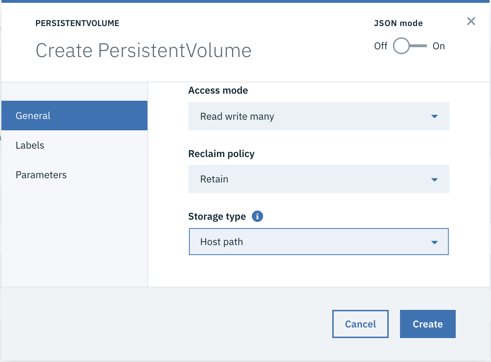

# Creating Persistent Volume in ICP

We will be using a persisten volume to deploy mongo db for our application.

To create a Persisten Volume 
1. Navigate to Menu > Platform > Storage
 

2. Select `Create Persistent Volume` 

3. In General set name, capacity, access type, storage type.
For our use case we will create a persisten volume with name `mongo-pv`, `5 gb` capacity with `Read write many` access mode and storage type `Host Path`

4. In Parameter set `key` to `/renovate`

5. Click create.