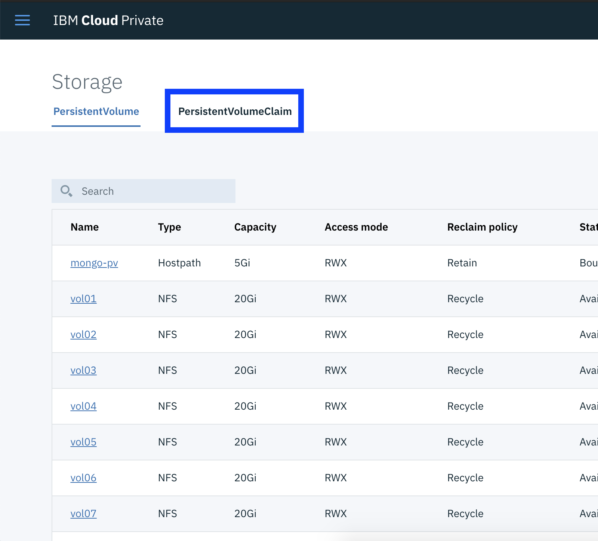
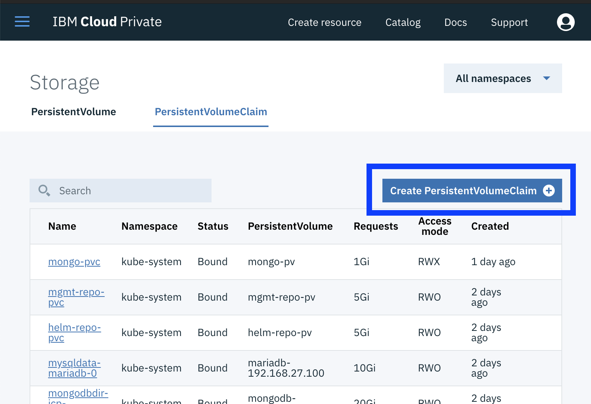
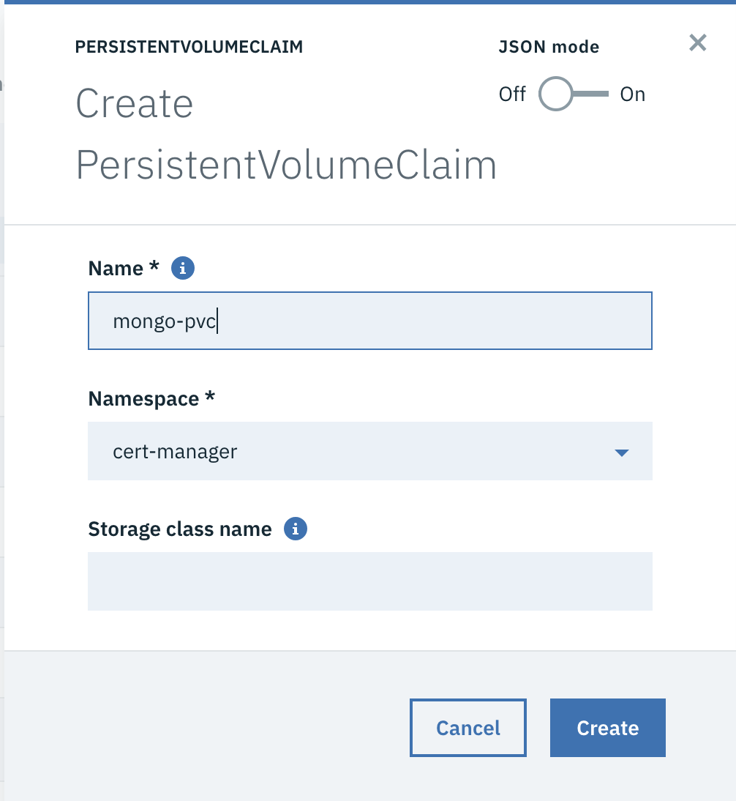
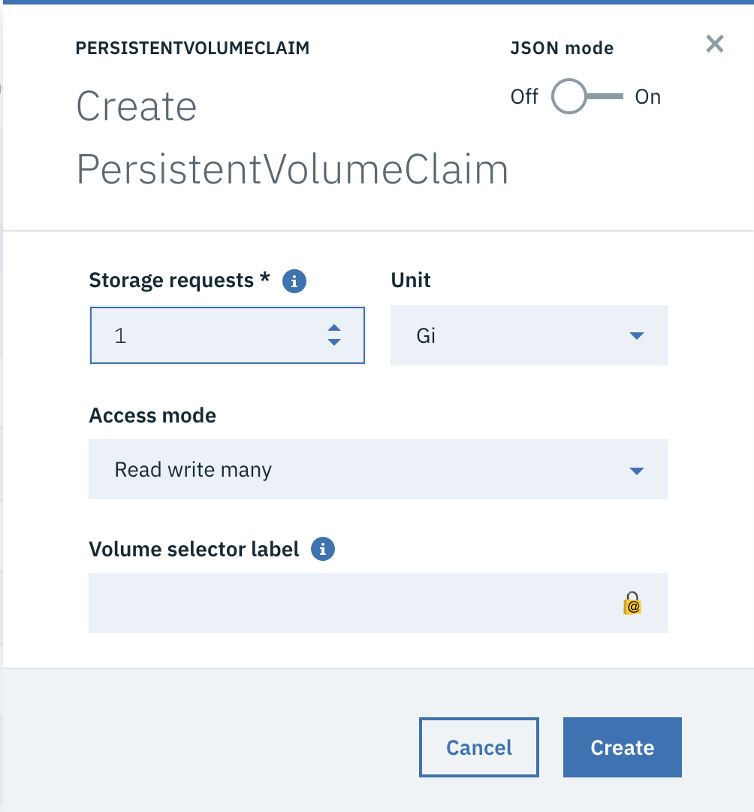

# Create Persistent Volume Claim in ICP

To create persistent volume claim in IBM Cloud Private

1. After you have created a persistent volume, click on the `Persistent Volume Claim` tab.

2. Click on `Create PersistentVolumeClaim` button

3. Select a name, storage request and access mode. 
For our case we are going with `mongo-pvc`, `1 Gb` and `Read write many`

4. Click Create.