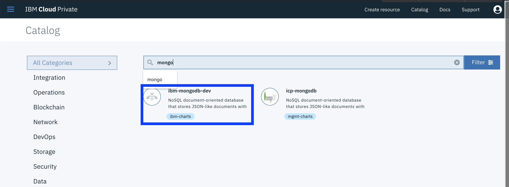
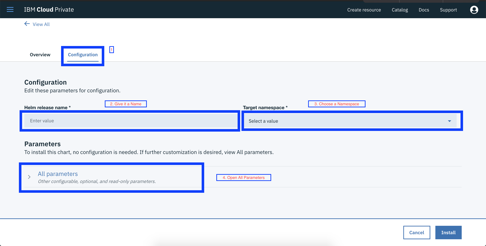
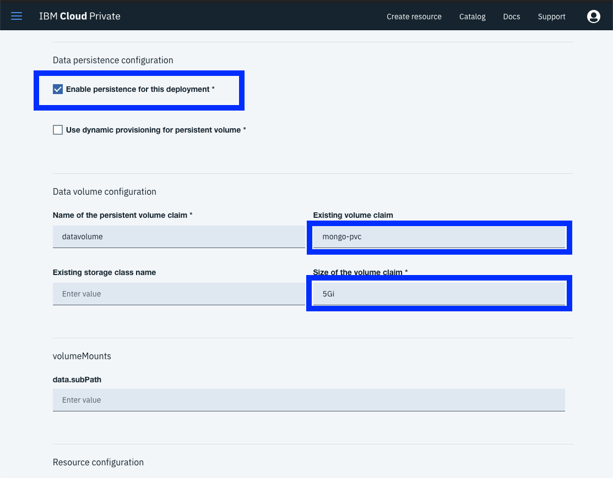
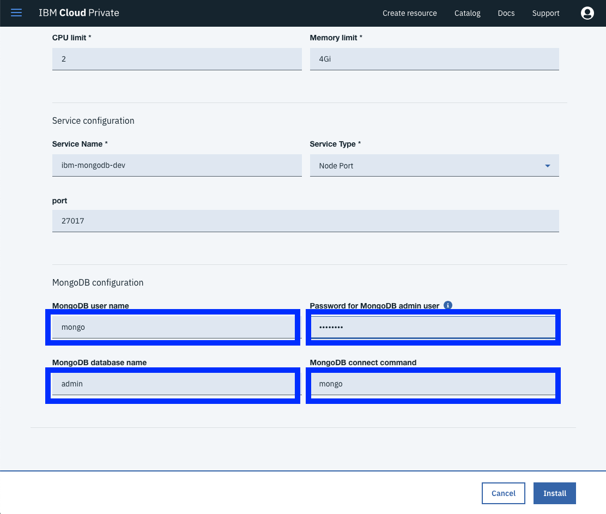

# Create Mongo-DB deployment in ICP

To create a mongo db deployment in Ibm Cloud Private 
1. Navigate to catalog in the top right corner.

2. Search for `mongo` in the catalog. Select mongodb

3. Move to configuration tab and give the release a name. 

4. Expand `All Parameters`

5. Check `Enable Persistance for this deployment`. In **Data Volume Configuration** put the name of the **Persistent Volume Claim** created in the last section. In our case its called `mongo-pvc`. Set the size of the claim to `5 Gb`

6. In **MongoDB Configuration** set a username, password, database name and mongo connect command.

7. Click Install. 